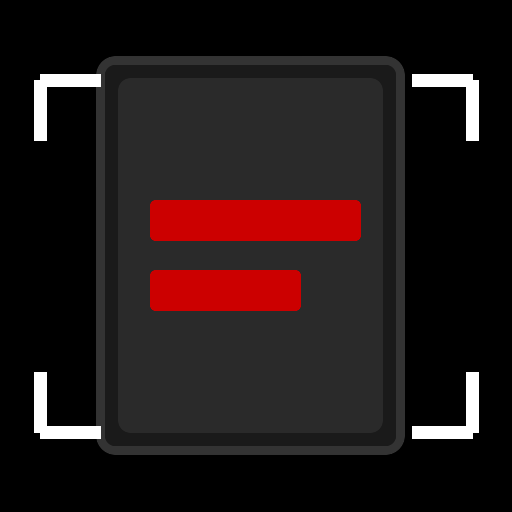

<p align="center">
  
</p>

<h1 align="center">🔴 REDACTED</h1>

<p align="center">
  <b>Scan. Redact. Protect.</b>
  <br/>
  A document scanner with built-in redaction capabilities.
</p>

<p align="center">
  <a href="https://github.com/alephtex/redacted-scan/releases"></a>
  <a href="LICENSE"></a>
</p>

<h3 align="center">
  <a href="https://github.com/alephtex/redacted-scan/releases">⬇️ Download APK</a>
</h3>

---

## 🕵️ About

**Redacted** is a privacy-focused Android document scanner with powerful redaction tools. Scan documents, black out sensitive information, and export as PDF or JPEG — all without internet access.

Featuring a sleek **CIA Red theme** with pure AMOLED black background for that authentic classified document feel.

---

## 📸 Features

### Scanning
- 📷 **AI-powered document detection** — automatic edge detection
- 🔲 **Perspective correction** — straightens tilted documents
- ✨ **Image enhancement** — automatic contrast and clarity
- ⬛ **Black & White mode** — optional grayscale scanning

### Redaction
- ✏️ **Brush tool** — freehand redaction with live preview
- 📏 **Line tool** — draw straight redaction lines
- 🧹 **Eraser** — remove unwanted redactions
- 🎨 **Color picker** — choose redaction color (default: black)
- 📐 **Adjustable brush size** — fine to bold strokes
- ↩️ **Undo support** — fix mistakes easily

### Export & Privacy
- 📄 **PDF export** — multi-page document support
- 🖼️ **JPEG export** — single image output
- 🔒 **Fully offline** — no internet permission required
- 🚫 **No tracking, no ads** — your documents stay private

---

## 🎨 Theme

**CIA Red** — Pure AMOLED black with red accents

| Background | Buttons | Text |
|------------|---------|------|
| `#000000`  | `#FF0000` | `#FFFFFF` |

---

## 📱 Requirements

- Android 8.0+ (API 26)
- Camera

---

## 🛠️ Build

```bash
# Debug build
./gradlew assembleDebug

# Release build (requires signing config)
./gradlew assembleRelease \
  -PRELEASE_STORE_FILE="path/to/keystore.jks" \
  -PRELEASE_STORE_PASSWORD="password" \
  -PRELEASE_KEY_ALIAS="alias" \
  -PRELEASE_KEY_PASSWORD="password"
```

---

## 🔧 Technical Stack

- [Jetpack Compose](https://developer.android.com/compose) — Modern UI toolkit
- [CameraX](https://developer.android.com/media/camera/camerax) — Camera capture
- [LiteRT](https://ai.google.dev/edge/litert) — Document segmentation AI
- [OpenCV](https://opencv.org/) — Image processing
- [PDFBox-Android](https://github.com/TomRoush/PdfBox-Android) — PDF generation

---

## 👤 Credits

- **Redaction feature** by [alephtex](https://github.com/alephtex)
- **For** jk.bagba
- **Based on** [FairScan](https://github.com/pynicolas/FairScan) by Pierre-Yves Nicolas

---

## 📄 License

This project is licensed under the **GNU GPLv3**. See [LICENSE](LICENSE) for details.

---

<p align="center">
  <b>🔴 CLASSIFIED 🔴</b>
</p>
